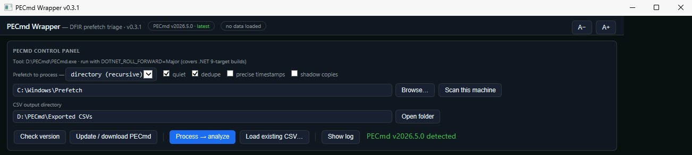
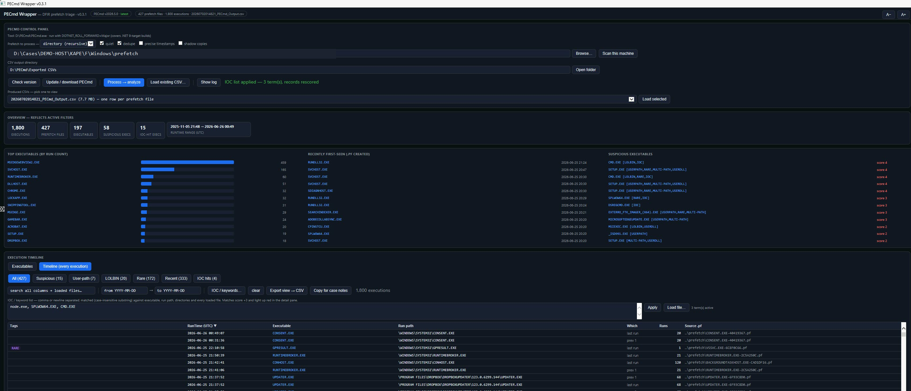

# PECmd Wrapper

A single-file, double-clickable GUI for triaging **Windows Prefetch** with [Eric Zimmerman's PECmd](https://ericzimmerman.github.io/) — built for DFIR casework.

No install, no dependencies, no framework: one `.hta` file that runs on any Windows box via the built-in `mshta.exe`. Point it at a live `C:\Windows\Prefetch`, a single `.pf`, or a KAPE/Velociraptor collection tree, and it runs PECmd for you and turns the output into an interactive, suspicion-scored triage view.





## Features

- **Runs PECmd for you** — file or recursive-directory mode, `-q` / `--dedupe` / `--mp` / `--vss` switches, output to timestamped CSVs. Runs asynchronously in a visible console so the UI never freezes.
- **Self-managing tooling** — finds `PECmd.exe` next to the `.hta` (or in `C:\ZimmermanTools`), checks the live latest version against ericzimmerman.github.io, and can download/update a self-contained copy with one click. Sets `DOTNET_ROLL_FORWARD=Major` automatically so .NET 9-target builds run on newer runtimes.
- **Two views of the same data**:
  - **Executables** — one row per prefetch file: derived run path, run count, last run, first-seen (`.pf` created), hash, size.
  - **Timeline** — every recorded execution (LastRun + the 7 previous run timestamps), flattened and sorted; verified to match PECmd's own `_Timeline.csv` row-for-row.
- **Suspicion scoring** tuned on real incident data (see table below). Suspicious rows are shaded; every tag shows its reasoning on hover.
- **IOC / keyword list** — paste or load terms; matched case-insensitively against executable names, run paths, directories and **every loaded file**, rescoring live (+3 per hit). Catches cross-references you will not spot in a grid (e.g. a system binary that loaded a file whose path contains your IOC).
- **Filters** — category buttons with live counts (All / Suspicious / User-path / LOLBIN / Rare / Recent / IOC hits), free-text search across all columns *including loaded files*, and a UTC date range.
- **Detail pane** — click any row: all 8 run timestamps, volumes, directories, and the full FilesLoaded list with IOC hits highlighted red and user-writable paths orange. A **"hide OS support files"** checkbox (on by default) suppresses MUI/DLL/INI/NLS/$MFT/MUN/TLB/SYS/SCH/DAT/MANIFEST/AUX/SDB/CONFIG noise — IOC-hit and user-path entries are never hidden, whatever their extension.
- **Reporting** — export the filtered view (either view) to CSV, or copy formatted lines straight into case notes.
- **Overview dashboard** — top executables, newest first-seen, and score-ranked suspicious list; all recomputed to reflect active filters, all clickable.
- **Resizable columns** (v0.5.0) — drag a column header's right edge to resize; double-click the edge to reset. Widths are remembered per view (Executables / Timeline / generic grid) in a small `PECmd-Wrapper.settings.json` next to the app.

## Quick start

1. Download `PECmd-Wrapper.hta` into an empty folder.
2. Double-click it. If `PECmd.exe` isn't found next to it, the app offers to download the latest official build from `download.ericzimmermanstools.com` into the same folder.
3. Point the input at a prefetch source and click **Process → analyze**:
   - `C:\Windows\Prefetch` for the live machine (**run elevated** — the app detects and tells you if it can't read it),
   - a collected `Windows\Prefetch` folder from a KAPE / Velociraptor / other collection tree (URL-encoded paths like `C%3A` are handled),
   - or a single `.pf` file.
4. Or skip processing entirely and **Load existing CSV…** to analyze a PECmd CSV you already have. Non-prefetch CSVs (e.g. the Timeline CSV) open in a generic sortable grid.

## Suspicion heuristics

Score ≥ 2 marks a row suspicious. Tuned against real-world datasets to keep the flagged set small enough to actually read.

| Tag | Trigger | Score |
|---|---|---|
| `USERPATH` | Runs from a user-writable path (`\Users\`, `\AppData\`, `\Temp\`, `\Downloads\`, `\ProgramData\`, `\PerfLogs\`, `\Windows\Temp\`, `$Recycle.Bin`, `\Public\`; Defender's ProgramData platform dir excluded) | +2 |
| `LOLBIN` | Dual-use binary (powershell, cmd, wscript, mshta, rundll32, regsvr32, certutil, bitsadmin, msiexec, curl, node, java, python, psexec, wmic, …) | +1 (+1 more if also user-path) |
| `MASQ` | OS-binary name (svchost, lsass, explorer, …) running **outside** `\Windows\` | +3 |
| `IOC` | User IOC/keyword list hit anywhere in the record incl. loaded files | +3 |
| `MULTI-PATH` | Same executable name runs from **both** system and user-writable paths (version-number path segments neutralized) | +1 |
| `USERDLL` | System / Program Files binary loading a DLL from a temp path | +1 |
| `RANDOM` | Hex-blob or entropy-smelling executable name | +1 |
| `RARE` | Run count ≤ 2 and recent (last 14 days of the dataset) — filter only, no score | 0 |

## Notes & limitations

- All timestamps are displayed **as PECmd emits them: UTC**. No local-time conversion, on purpose.
- Windows 11 24H2 introduced prefetch **version 31 (0x1F)** — PECmd builds older than 2026.x cannot parse it ("Unknown version"). The wrapper detects this in the run log and points you at the update button.
- Prefetch is not a complete execution record: SYSTEM services started at boot are often **not** prefetch-traced, prefetch may be disabled on servers/SSD-policy machines, and only the last 8 run timestamps per executable are retained. Absence of a `.pf` is not evidence of absence.
- Corrupt/sparse `.pf` files in collection trees (a common KAPE artifact for in-use files) are skipped by PECmd and counted in the status line rather than failing the run.
- Table display caps at 6,000 rows for responsiveness; exports always write the full filtered set.
- **Running from a network location** (mapped drive / UNC share) works, with one caveat: Windows zone policy blocks the UTF-8 file reader (`ADODB.Stream`) there, so the app automatically falls back to ANSI file IO (v0.3.2+) and logs a one-time note. Everything functions, but rare non-ASCII characters (e.g. accented usernames in paths) may display incorrectly. For full fidelity copy the folder to a local path and run it from there.

## Command line

The wrapper can be launched with arguments so an artifact-finder (or a shortcut) opens it already pointed at an artifact:

```
mshta.exe "PECmd-Wrapper.hta" "<inputOrCsv>" ["<outDir>"] [/auto]
```
- `<input>` — a `.csv` (auto-loaded into the viewer) or a `.pf` file / prefetch directory (prefilled; processed if `/auto`).
- `<outDir>` — CSV output directory (optional).
- `/auto` — process immediately.

## Credits

- [Eric Zimmerman](https://ericzimmerman.github.io/) for PECmd and the EZ Tools suite — this is an unaffiliated wrapper around his parser; all parsing credit is his.

## License

MIT License

Copyright (c) 2026 Ben Morris

Permission is hereby granted, free of charge, to any person obtaining a copy of this software and associated documentation files (the "Software"), to deal in the Software without restriction, including without limitation the rights to use, copy, modify, merge, publish, distribute, sublicense, and/or sell copies of the Software, and to permit persons to whom the Software is furnished to do so, subject to the following conditions:

The above copyright notice and this permission notice shall be included in all copies or substantial portions of the Software.

THE SOFTWARE IS PROVIDED "AS IS", WITHOUT WARRANTY OF ANY KIND, EXPRESS OR IMPLIED, INCLUDING BUT NOT LIMITED TO THE WARRANTIES OF MERCHANTABILITY, FITNESS FOR A PARTICULAR PURPOSE AND NONINFRINGEMENT. IN NO EVENT SHALL THE AUTHORS OR COPYRIGHT HOLDERS BE LIABLE FOR ANY CLAIM, DAMAGES OR OTHER LIABILITY, WHETHER IN AN ACTION OF CONTRACT, TORT OR OTHERWISE, ARISING FROM, OUT OF OR IN CONNECTION WITH THE SOFTWARE OR THE USE OR OTHER DEALINGS IN THE SOFTWARE.
